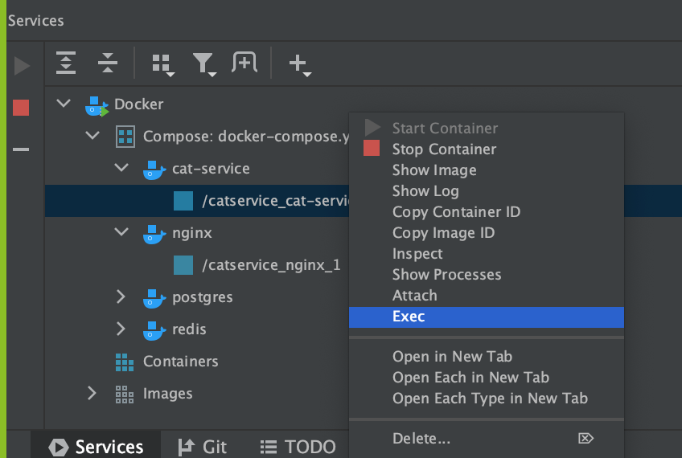
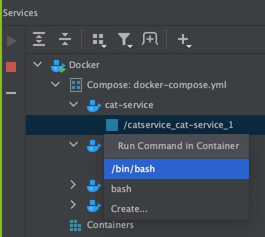
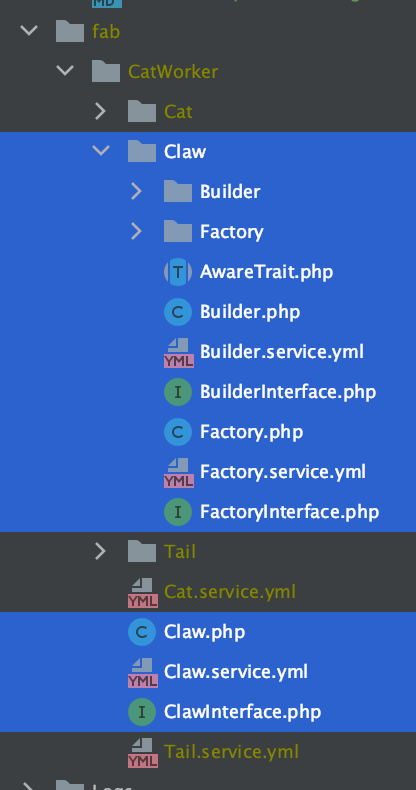
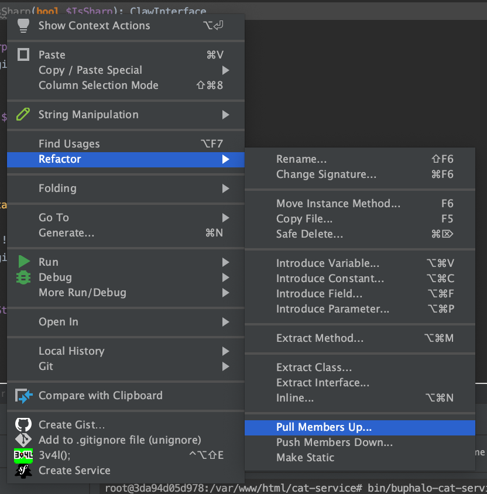
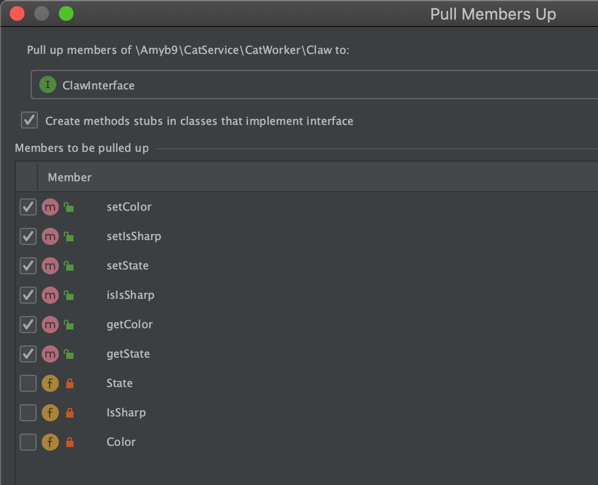

# Practical Steps To Creating New Actor Families & Composition
* Create a new Buphalo Fabrication File named "Claw".
    ```yml
    actors:
      <PrimaryActorName>.php:
        template: PrimaryActorName.php
      <PrimaryActorName>.service.yml:
        template: PrimaryActorName.service.yml
      <PrimaryActorName>Interface.php:
        template: PrimaryActorNameInterface.php
      <PrimaryActorName>/AwareTrait.php:
        template: PrimaryActorName/AwareTrait.php
      <PrimaryActorName>/Factory.php:
        template: PrimaryActorName/Factory.php
      <PrimaryActorName>/Factory.service.yml:
        template: PrimaryActorName/Factory.service.yml
      <PrimaryActorName>/FactoryInterface.php:
        template: PrimaryActorName/FactoryInterface.php
      <PrimaryActorName>/Factory/AwareTrait.php:
        template: PrimaryActorName/Factory/AwareTrait.php
      <PrimaryActorName>/Builder.php:
        template: PrimaryActorName/Builder.php
      <PrimaryActorName>/Builder.service.yml:
        template: PrimaryActorName/Builder.service.yml
      <PrimaryActorName>/BuilderInterface.php:
        template: PrimaryActorName/BuilderInterface.php
      <PrimaryActorName>/Builder/AwareTrait.php:
        template: PrimaryActorName/Builder/AwareTrait.php
      <PrimaryActorName>/Builder/Factory.service.yml:
        template: PrimaryActorName/Builder/Factory.service.yml
      <PrimaryActorName>/Builder/Factory.php:
        template: PrimaryActorName/Builder/Factory.php
      <PrimaryActorName>/Builder/FactoryInterface.php:
        template: PrimaryActorName/Builder/FactoryInterface.php
      <PrimaryActorName>/Builder/Factory/AwareTrait.php:
        template: PrimaryActorName/Builder/Factory/AwareTrait.php
    ```
* Execute `/bin/bash` using the cat-service container.
  
  
* run `bin/buphalo-cat-service.sh` to generate the Claw Actor Family.
* inspect the `fab` directory and notice that there exists a Claw Actor Family.
  
* move `Claw.php`, `ClawInterface.php`, & `Builder.php` to the `src` directory because we want to edit it and if we leave it in `fab` it will be overwritten next time we generate code.
* Create the following properties.
  * private bool $IsSharp;
  * private string $State;
  * private string $Color;
* Generate the getters and setters for the properties.
* Pull the methods into the ClawInterface so that we declare that these must exist to be considered a Claw.
  
  
* Create the following new property on the Cat class.
  * private ClawInterface $Claw;
* Generate getters and setters for the Claw property.
* Pull the methods into the CatInterface, thus declaring that all classes that implement CatInterface must have the following methods.
  * public function getClaw(): ClawInterface;
  * public function setClaw(ClawInterface $Claw): CatInterface;
